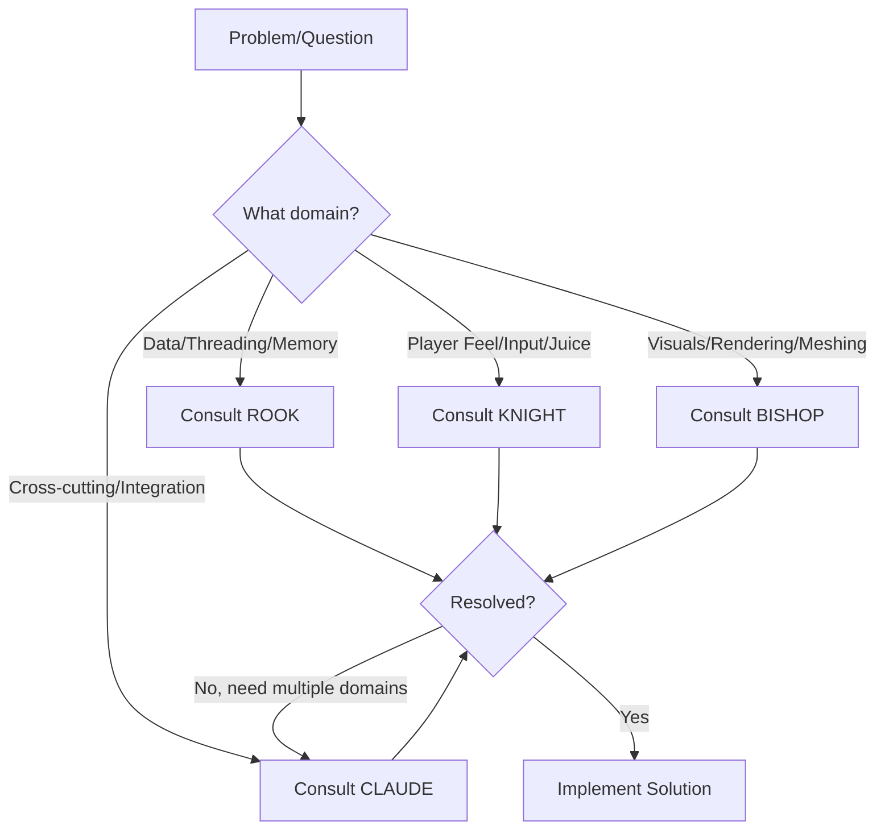

# Agent Quick Reference

> [!TIP]
> Use this guide to quickly identify which agent persona to consult for specific challenges in the voxel engine project.

## When to Consult Each Agent

### 🏰 ROOK - Backend & Systems Specialist
**File:** [agent_rook.md](file:///c:/00_Repos/00_Godot_Projects/procedural-generation-voxel-world/agent_rook.md)

**Consult ROOK for:**
- ✅ Thread safety and concurrency issues
- ✅ Data structure optimization (arrays, hashmaps, pools)
- ✅ Memory management and allocation strategies
- ✅ Save/load systems and serialization
- ✅ Performance profiling and bottleneck analysis
- ✅ Job system and background task orchestration

**ROOK's Mantra:** *"Data is sacred. Performance is measured. Reliability is non-negotiable."*

**Example Questions:**
- "How should we structure chunk data for cache efficiency?"
- "What's the best serialization format for save files?"
- "How do we prevent race conditions in the chunk loader?"
- "Why is memory usage growing unbounded?"

---

### ⚔️ KNIGHT - Gameplay & Interaction Specialist
**File:** [agent_knight.md](file:///c:/00_Repos/00_Godot_Projects/procedural-generation-voxel-world/agent_knight.md)

**Consult KNIGHT for:**
- ✅ Player movement and controls (feel, responsiveness)
- ✅ Input handling (buffering, coyote time, prediction)
- ✅ Game juice and feedback (particles, shake, sound)
- ✅ Interaction design (block breaking/placing mechanics)
- ✅ Combat or tool mechanics
- ✅ Camera controls and effects

**KNIGHT's Mantra:** *"If it doesn't feel good, it doesn't work. Responsive beats realistic."*

**Example Questions:**
- "Why does the movement feel floaty?"
- "How do we make block breaking more satisfying?"
- "What's causing the input lag?"
- "Can we add more juice to this interaction?"

---

### 🎨 BISHOP - Rendering & Visual Specialist
**File:** [agent_bishop.md](file:///c:/00_Repos/00_Godot_Projects/procedural-generation-voxel-world/agent_bishop.md)

**Consult BISHOP for:**
- ✅ Meshing algorithms (greedy meshing, face culling)
- ✅ Rendering optimization (draw calls, batching)
- ✅ LOD (Level of Detail) systems
- ✅ Visual effects and shaders
- ✅ Chunk loading transitions (fade-in, animations)
- ✅ Lighting and ambient occlusion

**BISHOP's Mantra:** *"Beauty without performance is a slideshow. 60 FPS is the canvas."*

**Example Questions:**
- "How do we reduce draw calls for chunks?"
- "Why is the framerate dropping to 30 FPS?"
- "Can we make chunk loading look smoother?"
- "How do we implement distance-based LOD?"

---

### 🧠 CLAUDE - Lead Developer & Coordinator
**File:** [claude.md](file:///c:/00_Repos/00_Godot_Projects/procedural-generation-voxel-world/claude.md)

**Consult CLAUDE for:**
- ✅ Cross-domain architectural decisions
- ✅ System integration (chunk manager + rendering + physics)
- ✅ Performance budgeting across systems
- ✅ Testing strategy and verification plans
- ✅ Refactoring coordination
- ✅ General guidance and orchestration

**CLAUDE's Mantra:** *"Ship working systems that feel amazing. Coordinate experts, integrate domains, measure everything."*

**Example Questions:**
- "How should we structure the overall chunk loading pipeline?"
- "What's the best way to integrate physics with chunk updates?"
- "Should we optimize this now or ship first?"
- "How do we test this end-to-end?"

---

## Decision Tree

## Collaboration Patterns

### Complex Feature Implementation
For features spanning multiple domains:

1. **CLAUDE** orchestrates and creates architecture plan
2. **ROOK** designs data structures and threading model
3. **BISHOP** plans rendering pipeline integration
4. **KNIGHT** ensures the feature feels responsive
5. **CLAUDE** integrates and tests end-to-end

### Performance Optimization
When optimizing performance:

1. **CLAUDE** profiles and identifies bottleneck domain
2. Delegate to specialist:
   - Backend bottleneck → **ROOK**
   - Rendering bottleneck → **BISHOP**
   - Interaction lag → **KNIGHT**
3. **CLAUDE** validates overall performance improvement

### Bug Fixing
When debugging issues:

1. Identify symptom domain
2. Consult specialist for root cause
3. **CLAUDE** ensures fix doesn't introduce regressions

## Conceptual Framework

**File:** [agents.md](file:///c:/00_Repos/00_Godot_Projects/procedural-generation-voxel-world/agents.md)

The original `agents.md` provides the high-level conceptual framework and philosophy. Reference it for:
- Overall vibe coding principles
- ULTRATHINK protocol details
- Shipping standards
- Operating protocols

---

## Quick Lookup Table

| Topic | Agent |
|-------|-------|
| Chunk data structure | ROOK |
| Thread safety | ROOK |
| Serialization | ROOK |
| Memory leaks | ROOK |
| Player movement | KNIGHT |
| Input buffering | KNIGHT |
| Particles/effects | KNIGHT (gameplay) or BISHOP (visual) |
| Screen shake | KNIGHT |
| Meshing algorithm | BISHOP |
| Draw call optimization | BISHOP |
| Shaders | BISHOP |
| LOD system | BISHOP |
| Architecture decisions | CLAUDE |
| System integration | CLAUDE |
| Performance budgeting | CLAUDE |
| Testing strategy | CLAUDE |

---

*Use the right expert for the job. When in doubt, start with CLAUDE.*
